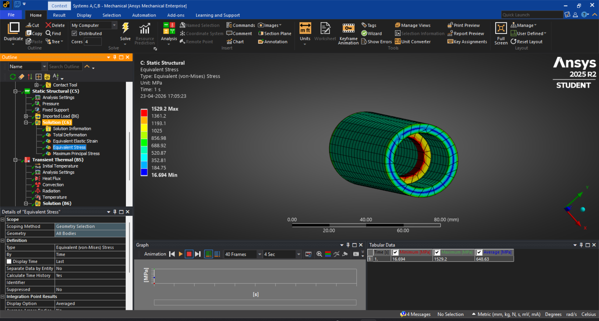
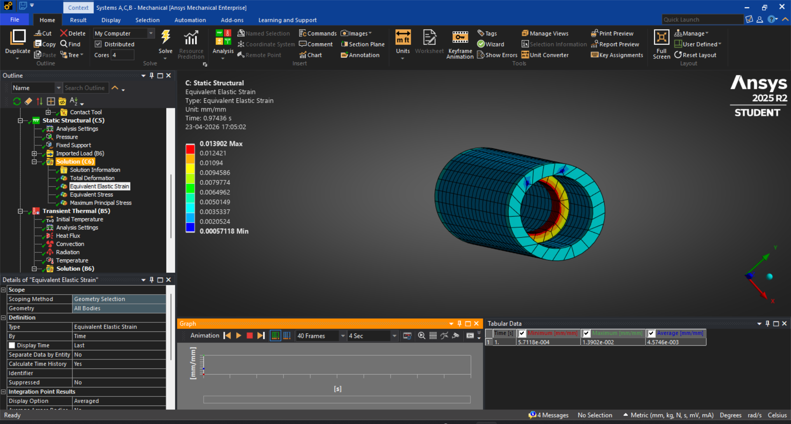
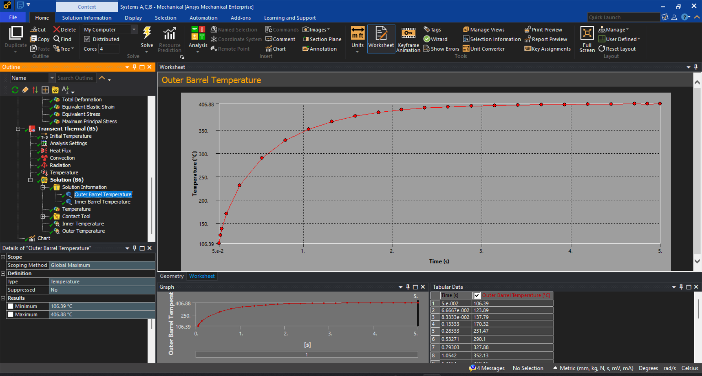
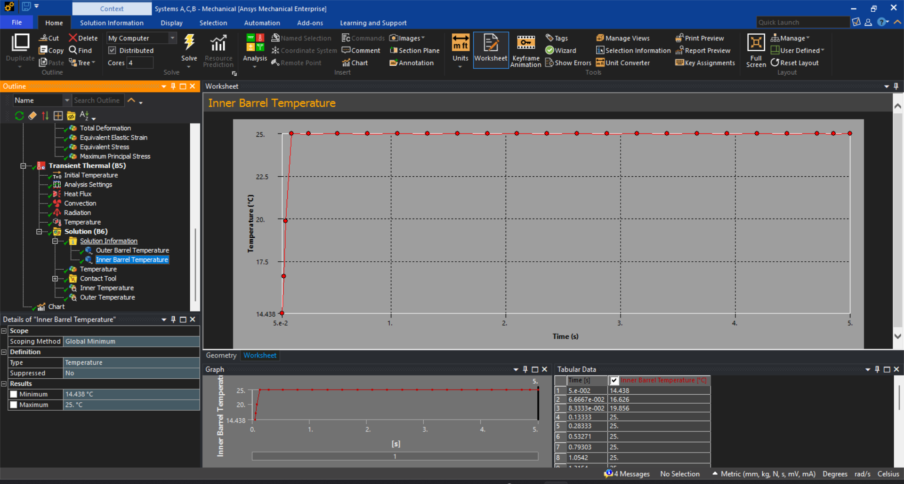

# 🔧 Gun Barrel Health Monitoring & Life Prediction System

## 📌 Overview
This project presents a physics-based structural health monitoring system designed to analyze thermo-mechanical behavior and predict the service life of gun barrels under extreme operating conditions.

The system integrates Finite Element Analysis (FEA) with embedded system concepts to enable predictive maintenance and early failure detection.

---

## ⚙️ Key Objectives
- Analyze stress and strain distribution under internal pressure
- Evaluate thermal behavior during operation
- Identify critical regions prone to failure
- Propose a sensor-based monitoring system for real-time health tracking

---

## 📊 Simulation Results (ANSYS Workbench)

### 🔥 Von Mises Stress Distribution (~1500 MPa peak)

### 📏 Equivalent Elastic Strain Distribution

### 🌡 Outer Barrel Temperature (~100°C → 400°C)

### 🌡 Inner Barrel Temperature Response

---

## 🧠 System Concept
The proposed system integrates:
- Temperature sensing
- Strain monitoring
- Vibration analysis
- Embedded processing (ESP32 concept)

---

## 🔧 Prototype
A conceptual prototype demonstrating structural design and sensor placement strategy.

---

## 🛠 Tools & Technologies
- ANSYS Workbench (FEA Simulation)
- Embedded Systems (ESP32 concept)
- Sensors (Temperature, Strain, Vibration)

---

## 🎥 Simulation Video
*(Add your video link here if needed)*

---

## 🚀 Future Improvements
- Real-time sensor integration
- IoT-based monitoring dashboard
- Live data acquisition and visualization
- Predictive maintenance algorithms

---

## 👨‍💻 Author
Krisanth M  
Electronics Engineering (VLSI)
